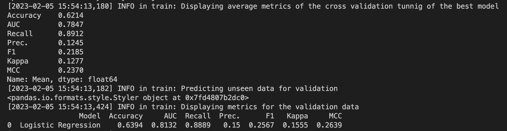
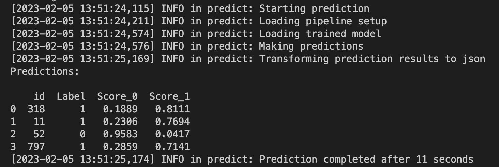
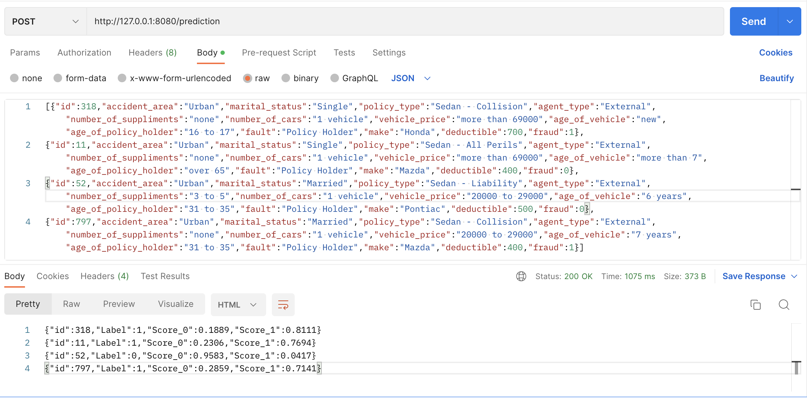
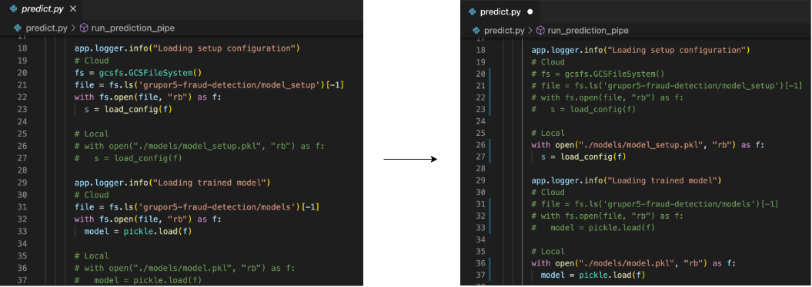
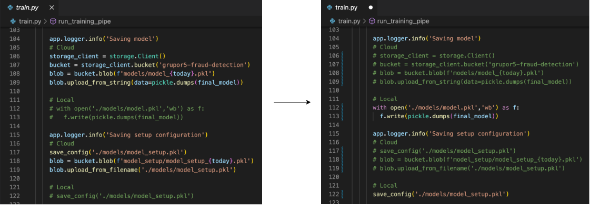
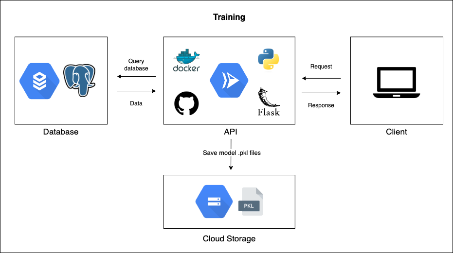
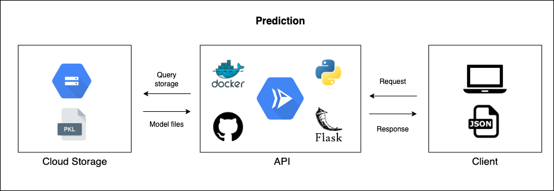

# PRUEBA DATA SCIENTIST R5 #
1. Cree una base de datos en PostgreSql (puede ser local) que debe contener una tabla llamada "fraudes" con la información contenida en ./data/fraude.csv. (el archivo ./data/create_table.txt te ayudará)

	**Base de datos PostgreSQL creada de manera local durante la entrevista y posteriormente creada en una instancia de Google Cloud SQL.**

2. Con su base de datos cargada, usando solo SQL replique la siguiente salida sin usar subconsultas.

	**Resuelto durante la entrevista.**

	    SELECT DISTINCT
	    monthh,
	    weekofmonth,
	    dayofweek,
	    AVG(fraudfound_p) OVER (PARTITION BY monthh) as percentage_fraud_month,
	    AVG(fraudfound_p) OVER (PARTITION BY monthh, weekofmonth) as percentage_fraud_month_week,
	    AVG(fraudfound_p) OVER (PARTITION BY monthh, weekofmonth, dayofweek) as percentage_fraud_month_week_day
	    FROM public.fraudes;

3. Conéctese desde Python a la tabla fraudes (la de la base de datos creada, no directamente del .csv) y léala con un query que la traiga lo más limpia posible.

	**Resuelto durante la entrevista.**

	    conn = psycopg2.connect(database=os.environ.get('DB_NAME'),
                        host=os.environ.get('DB_HOST'),
                        user=os.environ.get('DB_USER'),
                        password=os.environ.get('DB_PASSWORD'),
                        port=os.environ.get('DB_PORT'))
	    query = """ SELECT *
			    FROM public.fraudes
			    """
	    
	    fraud_data = pd.read_sql(query, conn)
	    fraud_data.head()

4.  En la carpeta  _./notebooks_  desarrolle un notebook de Jupyter o un script de Python su solución que debe contener al menos:
-   Un análisis descriptivo de los datos

	**Resuelto en el notebook *fraud_detection.ipynb* bajo el H1 "Exploratory Data Analysis".**
-   Un modelo de machine learning que prediga la probabilidad de que una reclamación sea o no un fraude (no se enrede mucho con hacer el mejor modelo, enfóquese en que sea algo funcional).

	**Resuelto en el notebook *fraud_detection.ipynb* bajo el H1 "Binary Classification Model".**

5.  Automatice su pipeline de entrenamiento en el archivo  _train.py_, imprimiendo por consola las métricas o exportando los principales hallazgos. Exporte el modelo y lo guarda en la carpeta  _./models_. En el archivo  _predict.py_  escriba el pipeline de predicción, pruébelo con el caso particular que usted desee e imprima por consola este caso y su probabilidad predicha.

	**Resuelto en los archivos indicados, en conjunto con los archivos adicionales app.py y main.py, por medio del Framework Flask de Python, para poder recibir requests por parte del usuario final y así se ejecuten los pipeline de entrenamiento y de predicción.**
	**- El endpoint */training* ejecuta el pipeline de entrenamiento, imprimiendo las metricas en consola y exportando los archivos pkl del modelo.**

	

	**- El endpoint */prediction* ejecuta el pipeline de predicción, imprimiendo las predicciones en consola y retornando a su vez las predicciones como un json en el response.** 

	

	

	**Para utilizar el modelo en local sigue los siguientes pasos:**
	1. Clona el repositorio en tu computador.**
	2. Instala las librerias necesarias que se encuentran enlistadas en el archivo *requirements.txt*
	3. Modifica los siguientes archivos como se indica en las imagenes:

		
		
		
		
	4. Inicia la app de Flask corriendo el archivo main.py.
	5. Realiza un request a localhost o http://127.0.0.1:8080 para probar los endpoints. (En el bonus point al final del archivo se presentan requests de prueba a cada endpoint.)

6.  Comenta como utilizaría el negocio este modelo para reducir las perdidas por fraude, como lo evaluarías frente a las necesidades del negocio (diferente a las métricas ya usadas).

	**El modelo de predicción de fraude creado permite diferenciar si un caso nuevo se encuentra dentro de los casos conocidos de fraude con cierto grado de confianza estadístico. De esta manera, el negocio puede identificar qué casos tienen mayor probabilidad de ser fraudulentos para proceder a investigarlos a fondo y así evitar perdidas monetarias, justificando que los datos relacionados al accidente reportado no son veridicos y por tanto el seguro no debe cubrirlo.**
	
	**Para evaluar el modelo frente a las necesidades del cliente guardaría los datos historicos de predicciones que el modelo haya realizado para poder compararlos con los verdictos reales que se concluyeron sobre los accidentes involucrados. Con estos datos se pueden calcular metricas como "Perdidas evitadas ($)" y "Fraudes evitados (Q)".**

7.  Comenta como podrías hacer deploy de este modelo a producción: Con que tecnologías y en que infraestrúctura. Bonus points: Montalo.

	**Para hacer el deploy a producción se propone utilizar un proveedor de servicios en la nube en el cual se pueda montar toda la infraestructura serverless en la cual correría el modelo; en este caso el proveedor sería [Google Cloud Platform](https://cloud.google.com/).**
	
	**Componentes:**
	**- Base de datos: La base de datos PostgreSQL se montó en una instancia del servicio Cloud SQL. Esta permite ser consultada por la API por medio de una IP privada y del uso del servicio Serverless VPC Network de GCP.**
	**- API: EL microservicio o API en el que corre el modelo se construyó utilizando del framework Flask de Python. El repositorio del codigo se encuentra alojado en GitHub, el cual posteriormente es usado por el servicio Cloud Run en conjunto con un Dockerfile para crear la app con implementación continua, la cual recibe los request del usuario final.**
	**- Storage: Para almacenar los archivos .pkl relacionados al modelo se hizo uso del servicio Cloud Storage.**

	
	**El usuario realiza un request al endpoint */training*, con el cual el API consulta a la base de datos para obtener los datos de entrenamiento, posteriormente ejecuta el pipeline de entrenamiento, y finalmente guarda los archivos .pkl relacionados al modelo.**

	
	**El usuario realiza un request al endpoint */prediction*, con el cual el API carga el modelo a partir de los archivos .pkl, posteriormente ejecuta el pipeline de predicción, y finalmente entrega los resultados de la predicción en formato JSON.**

	**Bonus point:**
	**El modelo se encuentra montado y funcionando por medio de la URL: https://r5-ds-challenge-avopasl7fa-uc.a.run.app**
	**Para probar el funcionamiento del entrenamiento realiza un request de tipo GET al endpoint */training*.**

	**Para probar el funcionamiento de la predicción realiza un request de tipo POST al endpoint /prediction, enviando los datos de los accidentes en el cuerpo del request como JSON.**
	**Body sample:** 

    
        [{"id":52,"accident_area":"Urban","marital_status":"Married","policy_type":"Sedan - Liability","agent_type":"External","number_of_suppliments":"3 to 5","number_of_cars":"1 vehicle","vehicle_price":"20000 to 29000","age_of_vehicle":"6 years","age_of_policy_holder":"31 to 35","fault":"Policy Holder","make":"Pontiac","deductible":500},{"id":797,"accident_area":"Urban","marital_status":"Married","policy_type":"Sedan - Collision","agent_type":"External","number_of_suppliments":"none","number_of_cars":"1 vehicle","vehicle_price":"20000 to 29000","age_of_vehicle":"7 years","age_of_policy_holder":"31 to 35","fault":"Policy Holder","make":"Mazda","deductible":400}]
